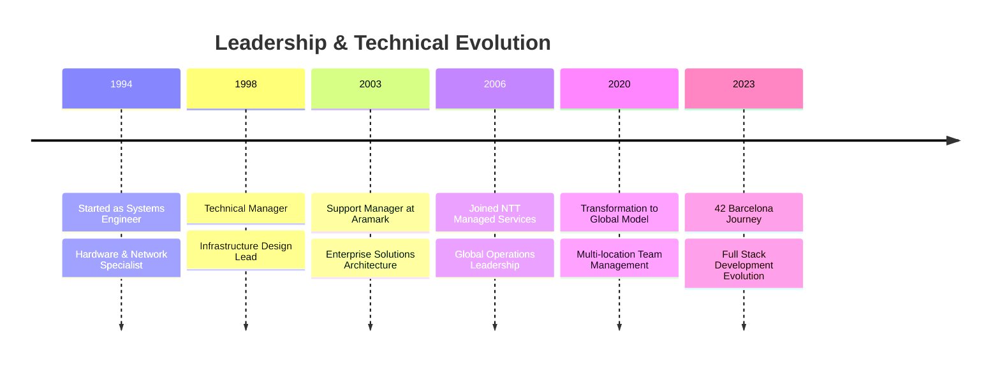
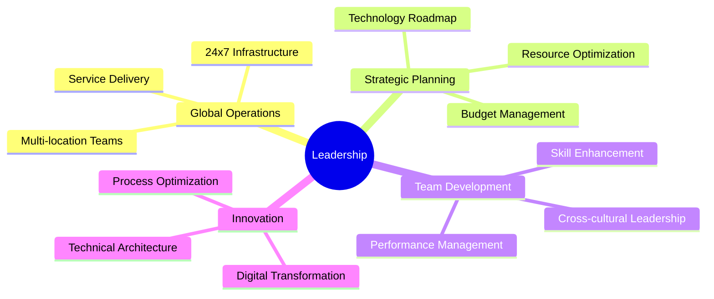

# 💫 Hi there! 👋

  

I'm **Carlos Escañuela García**, currently serving as **Delivery & Operations Director** at **NTT Managed Services**. With over 25 years of experience orchestrating mission-critical IT operations and leading global teams, I bring a comprehensive approach to technology leadership and innovation.

## 🌟 Professional Journey

## 🎯 Core Competencies

<table>
  <tr>
    <td align="center">
      
       Cloud Platforms
    </td>
    <td align="center">
      
       DevOps
    </td>
    <td align="center">
      
       Development
    </td>
    <td align="center">
      
       Systems
    </td>
  </tr>
</table>

## 🚀 Leadership Highlights

## 🛠️ Tech Stack

### 🔧 Programming & Development

#### Programming Languages

#### Frameworks & Tools

### Infrastructure & Systems

## 🎓 Professional Certifications

- IFCT0510 - IT Systems Management
- IFCT0210 - IT Systems Operation
- IFCT0509 - Internet Services Administration
- IFCD0210 - Web Applications Development
- IFCT0309 - Microcomputer Systems Assembly
- IFCT0209 - Microcomputer Systems

## 🚀 42 Barcelona Projects

### [tinky-winkey](./tinky-winkey)
- System utility tool for monitoring and debugging
- Real-time analysis and user-friendly interface
- `C++` `System Monitoring` `Debugging`

### [ft_transcendence](./ft_transcendence)
- Full-stack web application with real-time gaming
- OAuth integration and live gameplay
- `TypeScript` `NestJS` `PostgreSQL` `Docker`

### [cpp](./cpp)
- Advanced C++ programming modules
- OOP, RAII, polymorphism, and templates
- `C++` `OOP` `Memory Management`

### [cub3d](./cub3d)
- 3D game engine using raycasting
- Dynamic lighting and extended gameplay mechanics
- `C` `Graphics` `Mathematics`

### [minishell](./minishell)
- Fully functional Unix-like shell
- Advanced signal handling and error management
- `C` `Unix` `Process Management`

### [ft_irc](./ft_irc)
- IRC server with multithreading support
- Custom commands and optimized network communication
- `C++` `Networking` `Multithreading`

### [inception](./inception)
- Docker-based project with multiple services
- Focus on scalability and security
- `Docker` `DevOps` `System Administration`

### [so_long](./so_long)
- 2D game with dynamic enemies
- Optimized rendering for smooth animations
- `C` `Graphics` `Game Development`

### [push_swap](./push_swap)
- Efficient sorting algorithms implementation
- Optimized operation count using advanced data structures
- `C` `Algorithms` `Data Structures`

### [philosophers](./philosophers)
- Dining philosophers problem solution
- Focus on concurrency and deadlock prevention
- `C` `Threading` `Synchronization`

### [pipex](./pipex)
- Unix pipe functionality recreation
- Complex command chaining and I/O management
- `C` `Unix` `Process Management`

### [minitalk](./minitalk)
- Inter-process communication system
- Signal-based message transmission
- `C` `IPC` `Signal Handling`

### [ft_printf](./ft_printf)
- printf function recreation
- Support for various custom format specifiers
- `C` `String Processing` `Variadic Functions`

### [get_next_line](./get_next_line)
- File reading utility
- Efficient memory management and edge cases handling
- `C` `File I/O` `Memory Management`

### [libft](./libft)
- Custom C standard library
- Optimized versions of common functions
- `C` `Library Development` `Data Structures`

### [born2beroot](./born2beroot)
- System administration project
- Security configuration and monitoring tools
- `System Administration` `Security` `Virtualization`

## 🌐 Global Experience

  <table>
    <tr>
      <td align="center">
        
      </td>
      <td align="center">
        
      </td>
      <td align="center">
        
      </td>
    </tr>
  </table>

## 📈 Achievement Metrics

  <table>
    <tr>
      <td align="center">
        
      </td>
      <td align="center">
        
      </td>
      <td align="center">
        
      </td>
    </tr>
  </table>

## 📈 GitHub Stats

## 🌍 Languages

- 🇪🇸 Spanish (Native)
- 🇬🇧 English (Professional)
- 🇪🇸 Catalan (Native)

## 📫 Let's Connect

  
  

---

  

