# 💫 Hi there! 👋

  

I'm **Carlos Escañuela García**, currently serving as **VP of Service Design Architecture** at **NTT DATA**. With over 25 years of experience orchestrating mission-critical IT operations and leading global teams, I bring a comprehensive approach to technology leadership and innovation. My journey is fueled by a commitment to excellence and a desire to continuously learn and adapt in the ever-evolving tech landscape.

## 🌟 Professional Journey

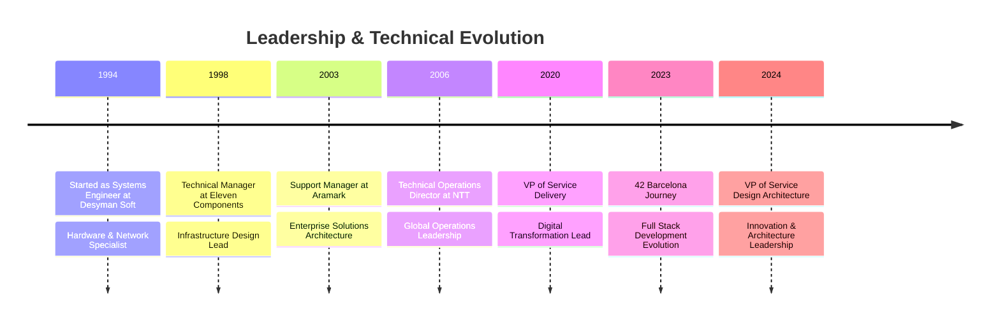

## 🎯 Core Competencies

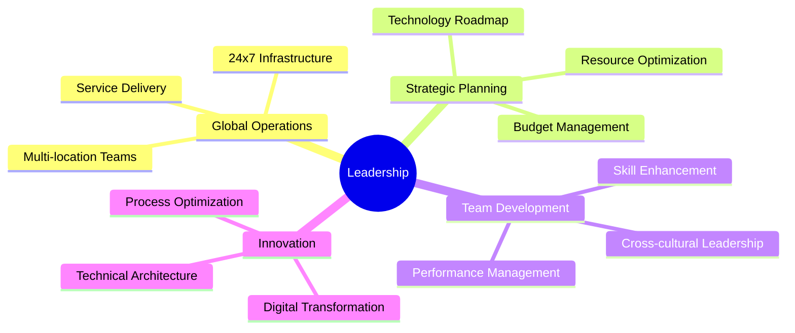

## 💼 Professional Impact

  <table>
    <tr>
      <td align="center">
        
      </td>
      <td align="center">
        
      </td>
      <td align="center">
        
      </td>
    </tr>
  </table>

### Key Responsibilities & Achievements
- **Global Team Management**: Leading distributed teams across Barcelona, Bangalore, and Hyderabad
- **Infrastructure Excellence**: Overseeing critical systems including:
  - Database Management Systems
  - Enterprise Resource Planning
  - Network Infrastructure
  - Security Architecture
  - Storage Solutions
  - Virtualization Platforms
- **Strategic Leadership**:
  - Budget planning and optimization
  - Resource allocation and management
  - Technology roadmap development
  - Service delivery enhancement
  - Performance metrics optimization
- **Innovation Initiatives**:
  - Digital transformation programs
  - Process automation and optimization
  - Architecture modernization
  - Cloud migration strategies

## 🛠️ Technical Expertise

### Development & Programming

<table>
  <tr>
    <td align="center">
      
       System Programming
       <small>C • C++ • Python</small>
    </td>
    <td align="center">
      
       Web Development
       <small>JavaScript • TypeScript • PHP</small>
    </td>
    <td align="center">
      
       Enterprise & Scripting
       <small>Java • Perl • Bash</small>
    </td>
  </tr>
  <tr>
    <td align="center">
      
       Databases
       <small>PostgreSQL • MySQL • SQL Server</small>
    </td>
    <td align="center">
      
       DevOps Tools
       <small>Docker • Kubernetes</small>
    </td>
    <td align="center">
      
       Development Tools
       <small>Linux • Vim • Git</small>
    </td>
  </tr>
</table>

### Development Tools & Technologies

### Web Technologies

### Development Environments

### Infrastructure & Cloud Architecture

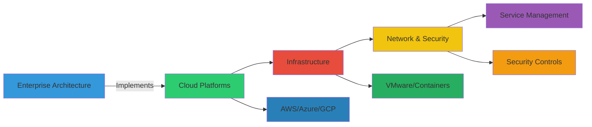

### Tools & Technologies

## 🎓 Education & Professional Certifications

### Education & Recent Achievements
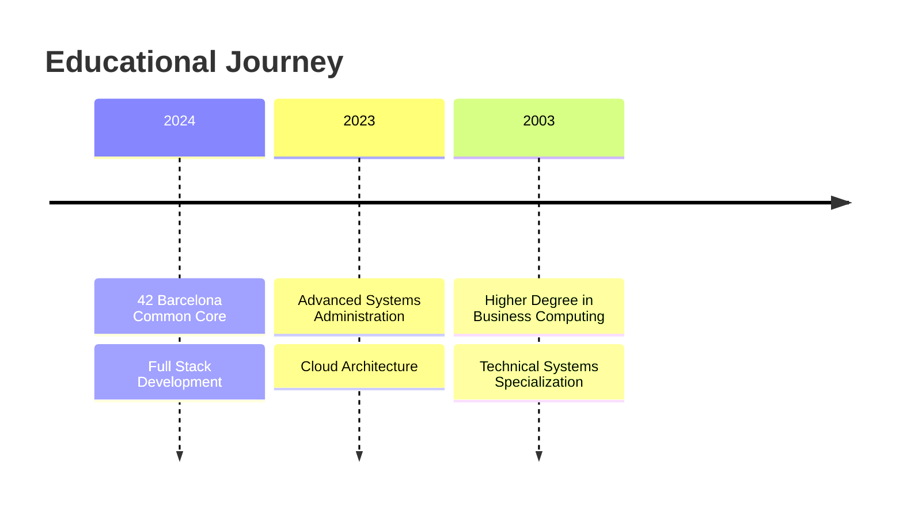

## 🎓 Professional Certifications

### Development & Programming
```mermaid
graph TB
    A[Software Development] -->|IFCD0112| B[Object-Oriented Programming]
    A -->|IFCD0111| C[Structured Programming]
    A -->|IFCD0210| D[Web Development]
    B -->|Specialization| E[Relational Databases]
    C -->|Focus| F[Business Applications]
    D -->|Technologies| G[Web Applications]
    style A fill:#3498db
    style B fill:#2ecc71
    style C fill:#e74c3c
    style D fill:#f1c40f
    style E fill:#9b59b6
    style F fill:#27ae60
    style G fill:#34495e
```

- **IFCD0210** - Web Applications Development
- **IFCD0112** - Object-Oriented Programming and Relational Databases
- **IFCD0111** - Structured Programming for Business Applications

### Systems & Infrastructure
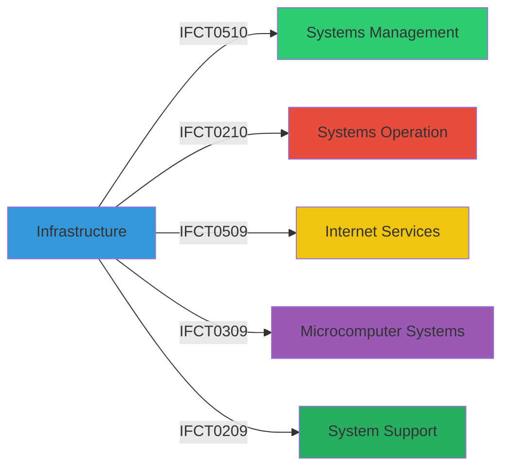

- **IFCT0510** - IT Systems Management
- **IFCT0210** - IT Systems Operation
- **IFCT0509** - Internet Services Administration
- **IFCT0309** - Microcomputer Systems Assembly and Repair
- **IFCT0209** - Microcomputer Systems

### Security & Services
```mermaid
graph TB
    A[Security & Services] -->|IFCT0609| B[IT Security]
    A -->|IFCT0109| C[Systems Security]
    A -->|IFCT0610| D[Email Services]
    B -->|Specialization| E[Security Implementation]
    C -->|Focus| F[System Protection]
    D -->|Management| G[Service Auditing]
    style A fill:#3498db
    style B fill:#2ecc71
    style C fill:#e74c3c
    style D fill:#f1c40f
    style E fill:#9b59b6
    style F fill:#27ae60
    style G fill:#34495e
```

- **IFCT0609** - IT Security
- **IFCT0109** - Computer Systems Security
- **IFCT0610** - Email Services Administration and Auditing

### FPCAT Accreditations
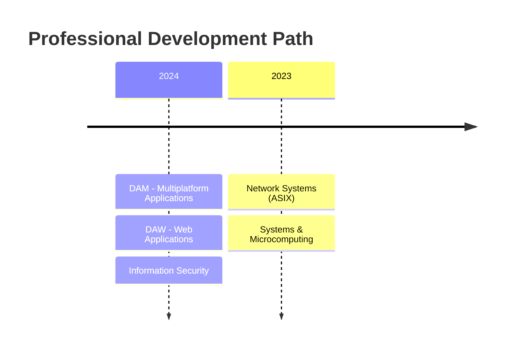

- **DAM** - Multiplatform Application Development
- **DAW** - Web Application Development
- **Information Security** - IT Security Specialist
- **ASIX** - Network Computer Systems Administration
- **SMX** - Microcomputer Systems and Networks

### Certification Distribution

  <table>
    <tr>
      <td align="center">
        
      </td>
      <td align="center">
        
      </td>
      <td align="center">
        
      </td>
    </tr>
  </table>

### Core Competencies
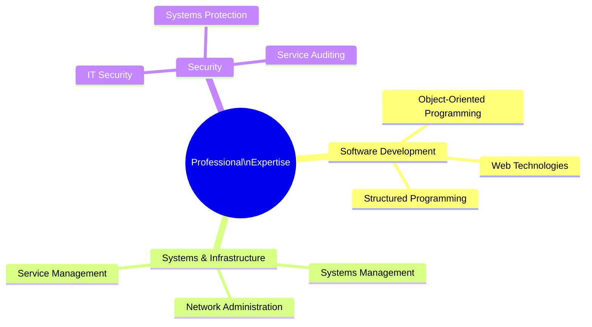

## 🚀 42 Barcelona Projects & Achievements

### Core Projects Portfolio

#### Advanced Development
- [ft_transcendence](./ft_transcendence) - Full-stack multiplayer game platform
  - `TypeScript` `NestJS` `PostgreSQL` `Docker` `WebSocket`
  - Real-time gaming with advanced features
  - OAuth integration and user management
  - Containerized deployment

- [cpp](./cpp) - C++ Programming Modules
  - `C++` `OOP` `STL` `Templates`
  - Advanced object-oriented programming
  - Memory management and RAII principles
  - Template metaprogramming

#### System Engineering
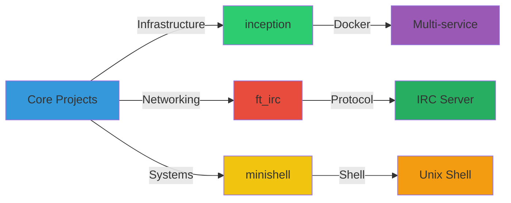

- [inception](./inception)
  - Docker-based multi-service infrastructure
  - `Docker` `Docker-Compose` `Nginx` `WordPress` `MariaDB`
  - Service orchestration and networking

- [ft_irc](./ft_irc)
  - Complete IRC server implementation
  - `C++` `Network Programming` `Multi-threading`
  - Custom protocol implementation

- [minishell](./minishell)
  - Custom Unix shell implementation
  - `C` `Process Management` `Parser Design`
  - Signal handling and job control

#### Graphics & Game Development
- [cub3d](./cub3d)
  - 3D game engine using raycasting
  - `C` `Mathematics` `Graphics` `Game Development`
  - Dynamic lighting and gameplay mechanics

- [so_long](./so_long)
  - 2D game with custom graphics engine
  - `C` `Graphics` `Game Logic`
  - Sprite animation and collision detection

#### Algorithm Specialization
- [push_swap](./push_swap)
  - Advanced sorting algorithm implementation
  - `C` `Algorithms` `Data Structures`
  - Operation count optimization

- [philosophers](./philosophers)
  - Dining philosophers problem solution
  - `C` `Threading` `Synchronization`
  - Deadlock prevention and resource management

#### System Monitoring & Tools
- [tinky-winkey](./tinky-winkey)
  - System monitoring and debugging utility
  - `C++` `System Programming` `Real-time Analysis`
  - Performance monitoring and diagnostics

#### Core Utils Implementation
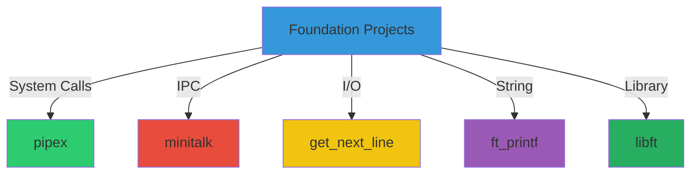

- [pipex](./pipex)
  - Unix pipe mechanism implementation
  - `C` `Process Management` `File Redirection`

- [minitalk](./minitalk)
  - Inter-process communication system
  - `C` `Signal Handling` `Binary Communication`

- [ft_printf](./ft_printf)
  - printf function recreation
  - `C` `Variadic Functions` `String Formatting`

- [get_next_line](./get_next_line)
  - File reading implementation
  - `C` `File I/O` `Buffer Management`

- [libft](./libft)
  - Custom C standard library
  - `C` `Data Structures` `Memory Management`

#### System Administration
- [born2beroot](./born2beroot)
  - System administration and security
  - `Virtual Machine` `System Configuration`
  - Security hardening and monitoring

### Achievement Metrics

  <table>
    <tr>
      <td align="center">
        
      </td>
      <td align="center">
        
      </td>
      <td align="center">
        
      </td>
    </tr>
  </table>

## 💼 Professional Experience

### NTT DATA (2006 - Present)
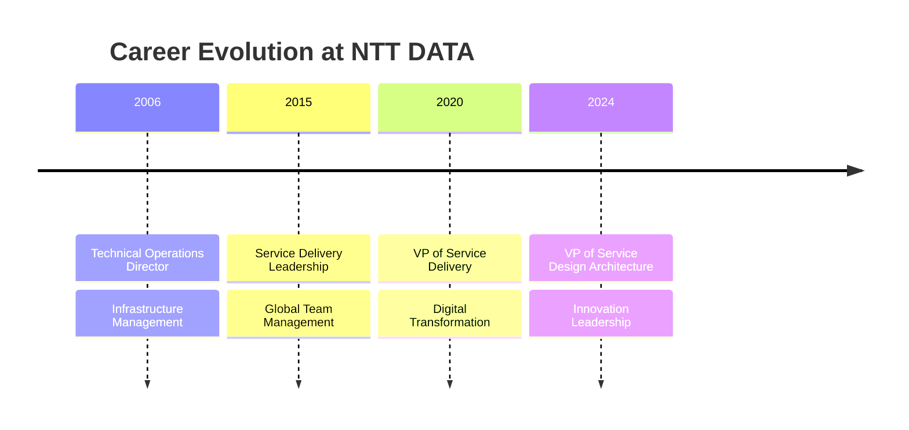

#### Key Achievements
- Led digital transformation initiatives across multiple regions
- Managed distributed teams across Barcelona, Bangalore, and Hyderabad
- Implemented enterprise-wide infrastructure solutions
- Established global operational standards and procedures
- Optimized service delivery processes and metrics

### Previous Experience

#### Aramark (2003 - 2006)
**Support Manager**
- Managed local support team and infrastructure
- Led critical projects:
  - Domain and server migration (2000 to 2003)
  - Exchange migration
  - Citrix implementation (120 sites)
  - Platform migration to Linux
- Technologies: Active Directory, Exchange, SQL Server, Citrix, Security Solutions

#### Eleven Components S.L. (1998 - 2003)
**Technical Manager**
- Designed and implemented:
  - TCP/IP networks
  - InterLan communications
  - Security policies and systems
- Server administration and incident management
- Infrastructure sizing and configuration

#### Desyman Soft S.L. (1994 - 1998)
**Systems Engineer**
- Hardware and network technical lead
- Network installation and maintenance
- System and printer maintenance

## 🌐 Global Impact

  <table>
    <tr>
      <td align="center">
        
      </td>
      <td align="center">
        
      </td>
      <td align="center">
        
      </td>
    </tr>
  </table>

## 📈 GitHub Statistics

  

  

  

## 🌍 Languages

- 🇪🇸 Spanish (Native)
- 🇬🇧 English (Professional)
- 🇪🇸 Catalan (Native)

## 🔍 Areas of Expertise
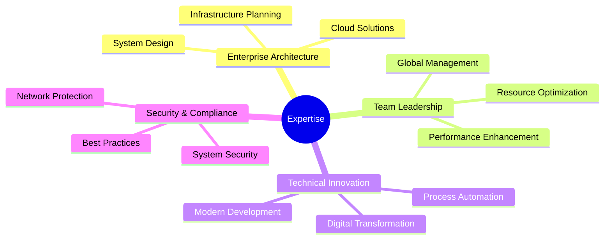

## 📫 Connect With Me

  
  

## 🤝 Let's Collaborate

I'm always interested in connecting with fellow technology enthusiasts and professionals. Whether you're interested in:
- Enterprise Architecture
- Cloud Solutions
- Digital Transformation
- Team Leadership
- Technical Innovation

Feel free to reach out for collaboration or professional discussions!

---

  

