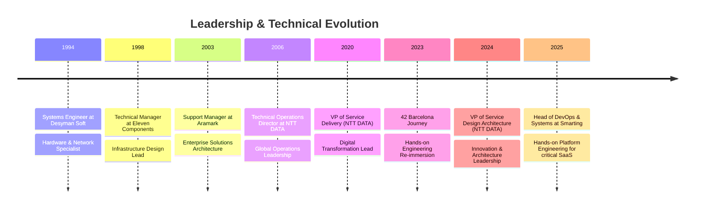

# 💫 Hi there! 👋

  

I'm **Carlos Escañuela García**. Currently leading **Platform Engineering & Systems** at **Smarting**, designing and operating the infrastructure that supports a critical public transportation SaaS platform serving millions of users in the Barcelona metropolitan area.

With 25+ years of IT leadership behind me — including 18 years at NTT DATA, where I served as **VP of Service Design Architecture** — I bring enterprise-grade discipline to a smaller, faster-moving environment. I'm hands-on again, and loving it.

---

## 🎯 What I'm Working On Right Now

**Building a Platform Engineering practice from the ground up** at Smarting, applying SRE principles to a critical-mission infrastructure:

- 🏗️ **Multi-CPD HA architecture** — 4-layer redundant network, 6 Proxmox clusters, 3 OKD clusters, OceanStor with HyperMetro
- 🤖 **Operational traceability at scale** — 28,000+ automated tickets/year proving every backup, patch, alert and incident
- 📊 **SIEM + IDS integration** — Wazuh (~82 agents) + Snort + n8n workflows generating actionable tickets in YouTrack
- 🔄 **Continuity automation** — Quarterly tabletop exercises and bi-weekly restoration tests, fully automated
- 📚 **Living documentation** — 230+ wiki articles covering architecture, runbooks, decisions and procedures
- ⚖️ **ENS / ISO 27001 compliance** — Built operational evidence rather than paperwork compliance

> Result: a Platform Engineering practice that went from "ad-hoc operations" to "automated traceability with measurable maturity" in **6 months**.

---

## 🚀 Featured Project: AIHubMatrix

  <h3>🌐 <a href="https://www.aihubmatrix.com">Try the LIVE DEMO</a></h3>
  
<strong>Switch between AI models mid-conversation</strong>

  

- 🔄 **Dynamic Model Switching** — Ask GPT-4o, then continue with Claude in the same thread
- 🎛️ **Conversation Control** — Choose exactly what context the AI sees
- 👁️ **Universal Vision** — Every model can analyze images
- 📁 **Folder Organization** — Familiar file system for managing your work
- 🔌 **Resilient Connections** — Processing continues even if your connection drops

  

---

## 🌟 Career Journey

```mermaid
timeline
    title Leadership & Technical Evolution
    1994 : Systems Engineer at Desyman Soft
         : Hardware & Network Specialist
    1998 : Technical Manager at Eleven Components
         : Infrastructure Design Lead
    2003 : Support Manager at Aramark
         : Enterprise Solutions Architecture
    2006 : Technical Operations Director at NTT DATA
         : Global Operations Leadership
    2020 : VP of Service Delivery (NTT DATA)
         : Digital Transformation Lead
    2023 : 42 Barcelona Journey
         : Hands-on Engineering Re-immersion
    2024 : VP of Service Design Architecture (NTT DATA)
         : Innovation & Architecture Leadership
    2025 : Head of DevOps & Systems at Smarting
         : Hands-on Platform Engineering for critical SaaS
```

---

## 🛠️ Current Technical Stack

The technologies I actually use today (not just "have used"):

### Platform & Infrastructure

<table>
  <tr>
    <td align="center">
       
      <strong>Container Platform</strong> 
      <small>OKD/OpenShift • Docker • AlmaLinux</small>
    </td>
    <td align="center">
       
      <strong>Automation</strong> 
      <small>Ansible • n8n • GitOps</small>
    </td>
    <td align="center">
       
      <strong>Observability</strong> 
      <small>Wazuh SIEM • Snort IDS • Prometheus • Grafana • VictoriaLogs</small>
    </td>
  </tr>
  <tr>
    <td align="center">
       
      <strong>Data Layer</strong> 
      <small>Cassandra • Kafka • PostgreSQL • Redis • Ceph</small>
    </td>
    <td align="center">
       
      <strong>Networking & CI/CD</strong> 
      <small>HAProxy • APISIX • Huawei USG • GitLab • TeamCity</small>
    </td>
    <td align="center">
       
      <strong>Development</strong> 
      <small>Python • Bash • TypeScript • C/C++</small>
    </td>
  </tr>
</table>

### Specialized Stack

### Cloud & Enterprise

---

## 🎓 What I Bring to a Platform Engineering Role

<strong>Click to expand: my approach to running critical infrastructure</strong>

### Operational Excellence
- **Traceability over hope**: every operation generates evidence (28k+ automated tickets/year)
- **Failure as a first-class citizen**: design assumes things will fail, automate the response
- **Documentation while building, not after**: 230+ wiki articles kept in sync with reality
- **Living runbooks**: not "documents nobody reads" — operational guides used daily by on-call

### Architecture Discipline
- **TOGAF-trained thinking**: layer separation, dependency analysis, decision records
- **Infrastructure as Code**: Ansible + GitLab + GitOps workflows
- **Observability by design**: SIEM, IDS, FIM, CVE scanning all generate actionable events
- **Defense in depth**: 6+ independent security layers, not one monolith

### Team & Culture
- **Cross-cultural leadership**: 18 years managing global teams across 3 continents
- **Knowledge transfer focus**: building infra that's operable by the team, not just by the architect
- **Compliance as a side effect**: build for operational excellence, certifications follow
- **Honest engineering**: clear separation between "operational target" and "measured commitment"

<strong>Click to expand: leadership & global ops experience (NTT DATA, 2006–2024)</strong>

### Roles
- **VP of Service Design Architecture** (2024)
- **VP of Service Delivery** (2020–2024)
- **Technical Operations Director** (2006–2020)

### Scale of Operation
- Distributed teams across **Barcelona, Bangalore and Hyderabad**
- 24/7 mission-critical infrastructure
- Multi-region service delivery
- Enterprise digital transformation programs
- Strategic budget and roadmap ownership

---

## 🔬 Personal Projects

<table>
  <tr>
    <td width="50%" valign="top">
      <h3>🌐 AIHubMatrix</h3>
      
Universal AI interface with mid-conversation model switching, dynamic context control, universal vision capabilities and folder organization.

      
<strong>Stack:</strong> React • Node.js • PostgreSQL

      

        
        
      

    </td>
    <td width="50%" valign="top">
      <h3>🤖 Claude Advanced Interface</h3>
      
Enterprise-grade AI interface for large-scale document processing. Handles files up to 200MB with real-time streaming and persistent storage.

      
<strong>Stack:</strong> Node.js • Docker • PostgreSQL

      

        
      

    </td>
  </tr>
</table>

---

## 🚀 42 Barcelona — Hands-on Re-immersion

<strong>16 completed projects · 1000+ hours of low-level coding</strong>

After 25 years in IT leadership, I went back to the trenches at **42 Barcelona** to reconnect with code at the deepest level — assembly, system calls, custom shells, network protocols, 3D engines from scratch. The best technical recharge I could have asked for.

### Highlighted projects
- **ft_transcendence** — Full-stack multiplayer game (TypeScript, NestJS, PostgreSQL, Docker, WebSocket)
- **inception** — Multi-service Docker infrastructure with orchestration
- **ft_irc** — Complete IRC server in C++ with multi-threading
- **minishell** — Custom Unix shell with process management and signal handling
- **cub3d** — 3D game engine using raycasting
- **philosophers** — Concurrent programming with deadlock prevention
- **libft / libft_malloc** — Custom C standard library and memory allocator
- **inception, born2beroot** — System administration and security hardening

[See all 16 projects in detail](https://github.com/cescanue?tab=repositories)

---

## 🎓 Education & Certifications

<strong>Click to view full credentials</strong>

### Academic
- **42 Barcelona Common Core** (2024) — Full Stack Development
- **Advanced Systems Administration** (2023) — Cloud Architecture
- **Higher Degree in Business Computing** (2003)

### Professional
- **TOGAF® 9 Foundation** — Enterprise Architecture
- **Lean IT Foundations (LITAF)**
- **Gen AI Level 1 & 2 Certifications**
- **Virtual Generative AI – Foundational**

### Spanish Professional Certifications
- **Development**: IFCD0210, IFCD0112, IFCD0111, IFCT0610
- **Infrastructure**: IFCT0510, IFCT0210, IFCT0509, IFCT0309, IFCT0209
- **Security**: IFCT0609, IFCT0109
- **FPCAT**: DAM, DAW, ASIX, SMX, Information Security

---

## 📈 GitHub Activity

  
  
  

---

## 🌍 Languages

🇪🇸 Spanish (Native) · 🇪🇸 Catalan (Native) · 🇬🇧 English (Professional)

---

## 💬 Let's Talk About

I'm always happy to connect with peers in:

- **Platform Engineering / SRE** — runbooks, on-call, traceability, observability done right
- **Infrastructure for critical SaaS** — HA, DR, multi-CPD, compliance frameworks
- **Compliance as engineering** — ENS, ISO 27001, ISO 22301 with operational evidence
- **Automation strategy** — when to automate, what to never automate, n8n vs custom code
- **Team scaling & knowledge transfer** — moving from "single hero" to "operable platform"
- **Enterprise → startup transitions** — bringing discipline without bureaucracy

---

## 📫 Connect

  
  

---

  

</content>
